Esta pantalla es la primera pantalla con la que se encontrará el usuario. Se encargará de que el usuario inicie sesión para poder entrar a la web. 

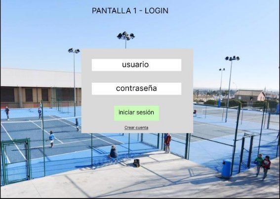

Si el usuario no tiene cuenta creada no tendrá acceso a la web. En esta página el usuario podrá registrarse. 

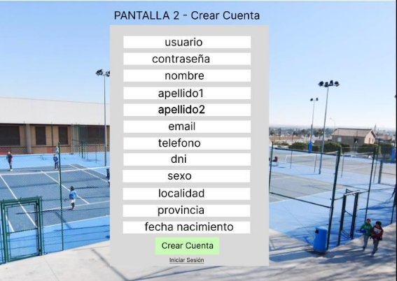La pagina principal. Es la primera pagina que veremos una vez hayamos iniciado sesión. Nos mostrará un mensaje de bienvenida y un enlace para reservar. En toda la web contaremos con la barra superior (navbar) para poder navegar entre las distintas paginas y opciones. 

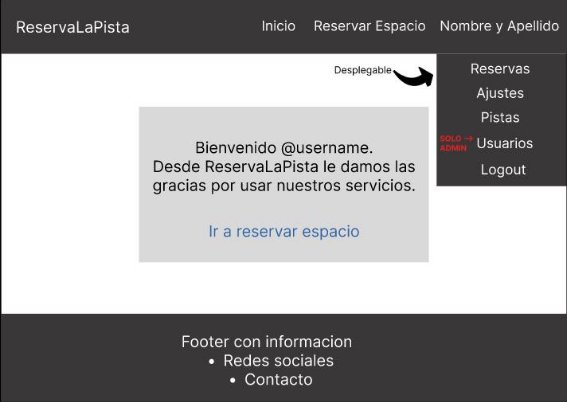

En esta pantalla podremos realizar nuestra reserva, seleccionando la pista, fecha y horas de alquiler. 

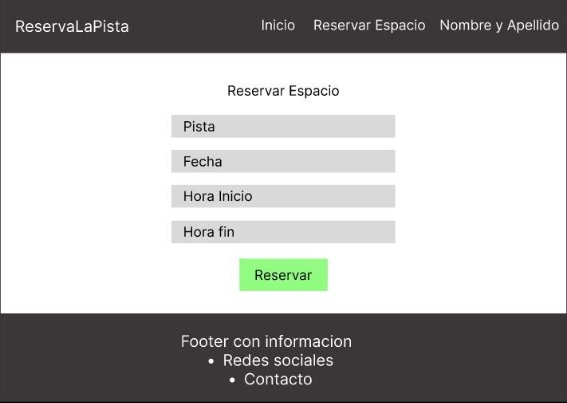Una vez realicemos la reserva, nos dirigirá a esta página, en la cual encontraremos una tabla con todas nuestras reservas realizadas y su información. 

Para lo usuarios administradores se les ha añadido la columna de usuario (para saber quien ha realizado la reserva) y la opción de eliminar la reserva. 

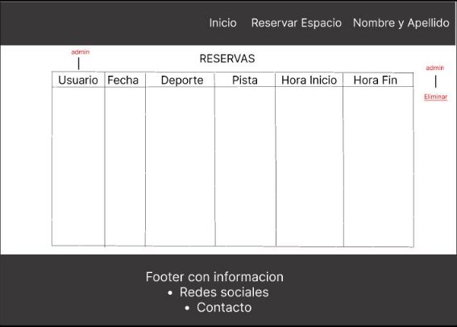

En esta pantalla podremos ver las pistas que hay para poder reservar. El usuario administrador tendrá la opción de editar y eliminar. 

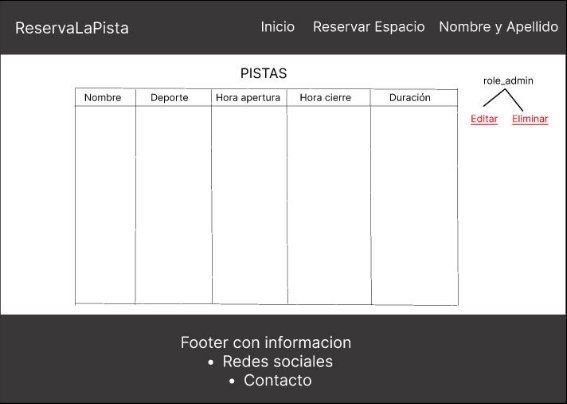

En esta pantalla, que solo tendrá permiso el usuario administrador, podrá editar la pista. 

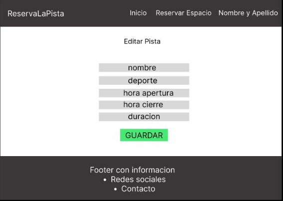Esta pantalla solo tiene permiso el usuario administrador. Podrá ver los usuarios que hay registrados en el sistema. En la tabla se muestra algunos datos de los usuarios, pero no todos. 

Para ver todos los datos de un usuario hay que darle al botón “Ver más info”. También cuenta con la opción de editar y eliminar. 

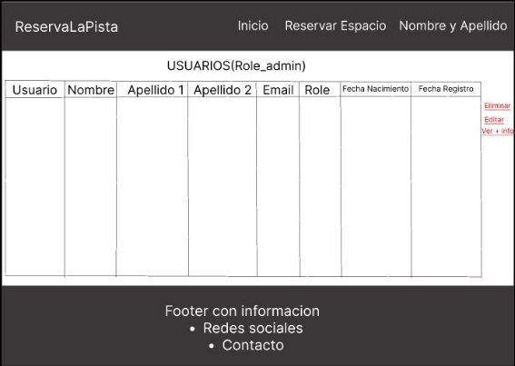

Pantalla para editar usuario. Cuando lo edita regresa a la pantalla anterior (Usuarios).

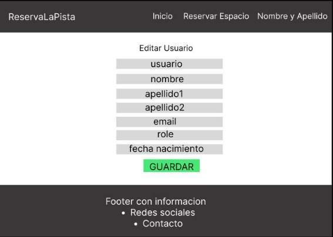Aquí vemos la lista que nos genera con todos los datos del usuario, cuando le damos a “Ver más info” en la tabla de usuarios. 

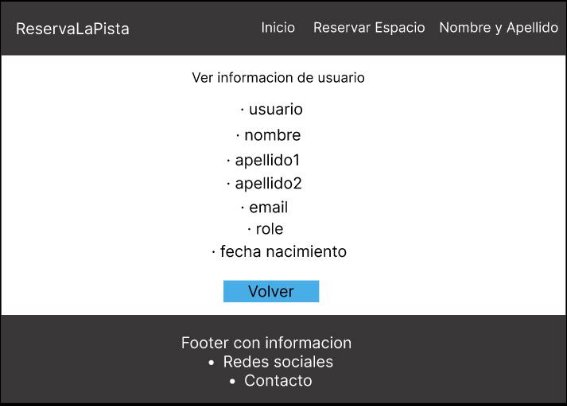

Pantalla principal de ajuste. Cuenta con un menú con tabs (pestañas). En el primero (datos), el usuario podrá modificar sus datos personales. 

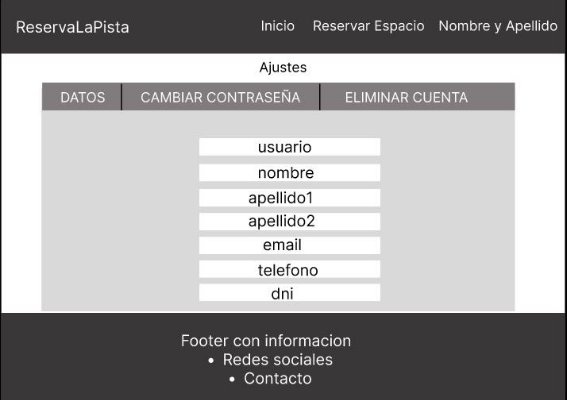

En esta opción de ajustes, el usuario podrá modificar su contraseña. 

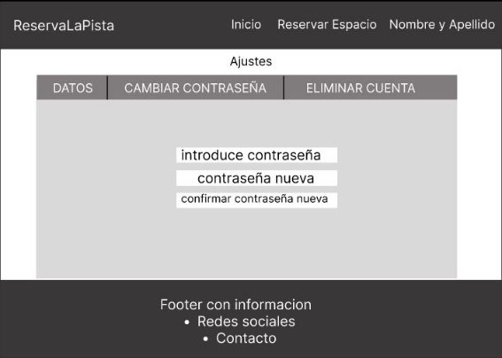

Por último, en esta opción el usuario podrá darse de baja eliminando su cuenta. 

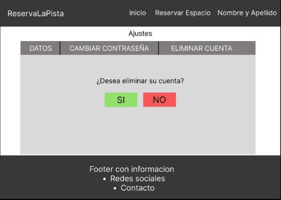

**ENLACE A FIGMA** 

[https://www.figma.com/proto/QimPtJcwo75veSZMt49Epf/ReservaLaPista?node- id=1%3A2&scaling=scale-down&page-id=0%3A1&starting-point-node-id=1%3A2](https://www.figma.com/proto/QimPtJcwo75veSZMt49Epf/ReservaLaPista?node-id=1%3A2&scaling=scale-down&page-id=0%3A1&starting-point-node-id=1%3A2) 
